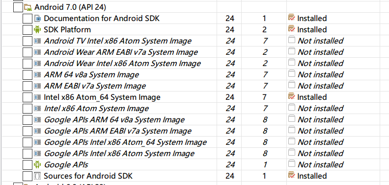

# Android SDK 设置相关指导文档

1. 打开 SDK

    

    Setting 界面里展示了 SDK 的基本情况。点击 下面的超链接打开 SDK Manager

2.  SDK 页面如下

   

3. 展开 Tools 列表， 此处为编译工具和平台构建工具，建议全部勾选下载安装。

   

4. 下面是不同的 Android 版本所提供的支持内容，以 Android 7.0 举例

   

   - Documentation for Android SDK 为对应的 SDK 文档，建议下载
   - SDK Platform 为对应版本的平台，必须下载
   - 名字里带 xxx System Image 的为对应版本的系统镜像，建议下载 Intel 系列的镜像进行使用，可以缓解模拟器卡顿。
   - Google APIs 为Google 产品 SDK 的支持代码，一般不需要下载。
   - Sources for Android SDK 为对应平台的API 源码，必须下载，否则看不了对应类的源码和注释。

5. Extras 中的内容如下

   

   只需要下载 Android Support Repository 和 HAXM installer 即可。

   HAXM installer 为 Intel 提供的模拟器驱动， 安装后可以大幅提高模拟器的运行速度。