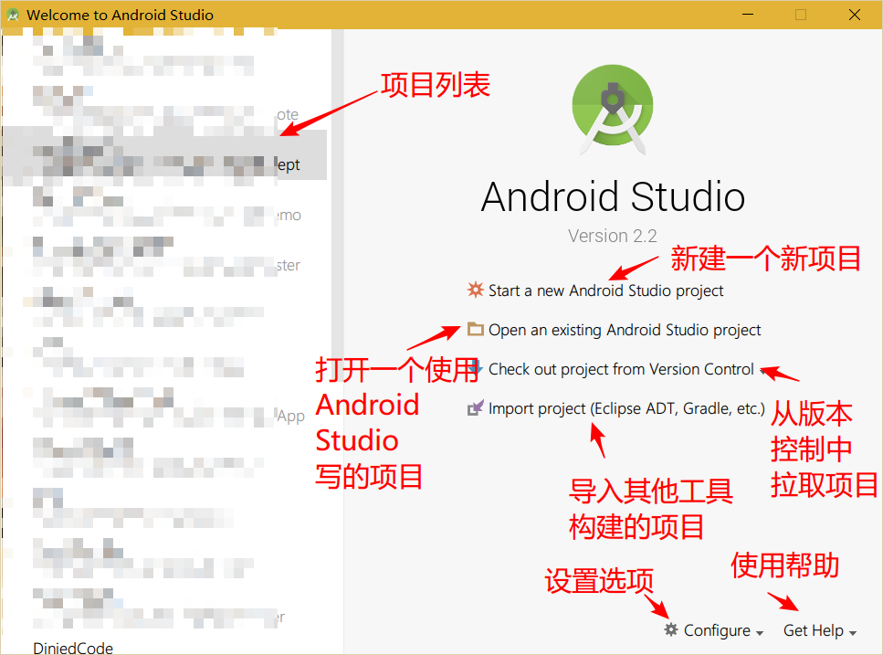
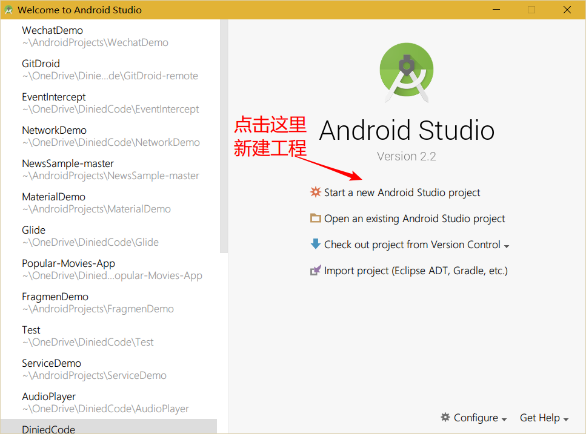
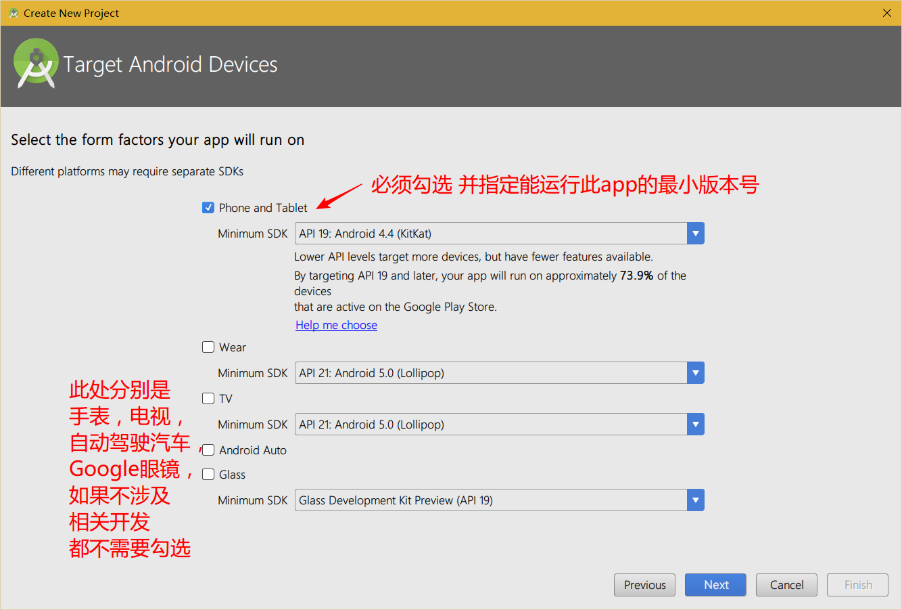
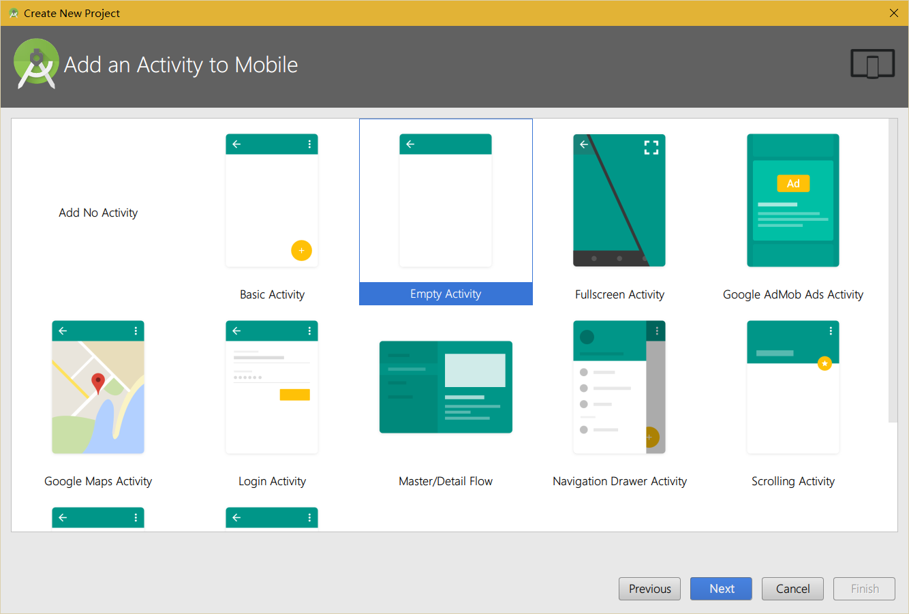
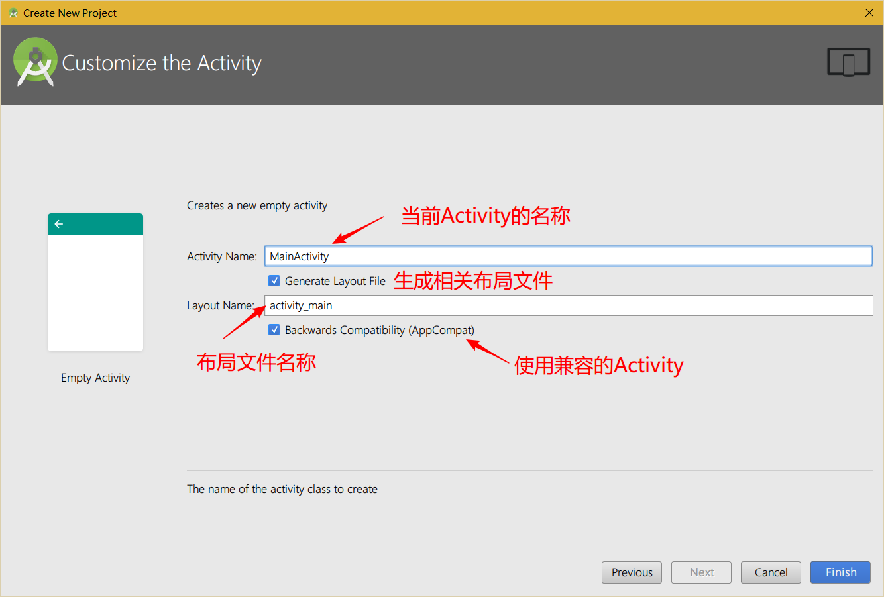
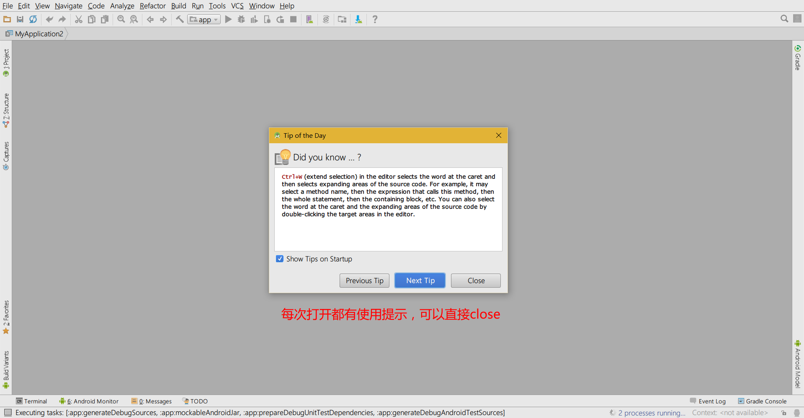
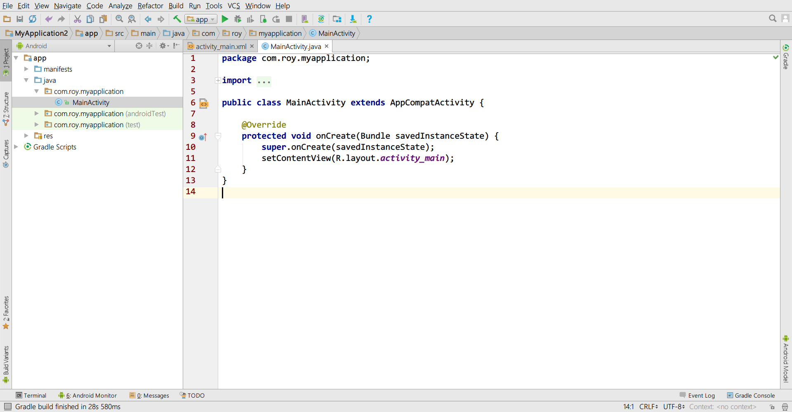

# Android Studio 新建工程指导

1. Android Studio 的界面

   刚打开是这样的

   

2. 新建项目

   

3. 相关编辑框的内容

   

4. 下一步后的相关选项

   

5. 选择一个Activity 

6. 新建Activity的相关选项

   

   点击Finish后开始构建项目

7. 项目构建中

   

8. Android Studio 工程界面

   

9. 项目构建完成

   

关于如何使用Android Studio 以及 Gradle 等相关设置将会有视频提供讲解