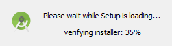

# Android Studio 配置指导文档

1. Android Studio 的下载

   [Android Studio 官方网站](https://developer.android.com/develop/index.html) 需要翻墙

   [国内镜像网站](http://www.androiddevtools.cn/)

   

2. 安装
     
     
    

3. 选择安装的内容

   红色方框内分别是 SDK(开发工具包) 和 Android模拟器，如果第一次安装建议勾选

    

4. 选择安装路径

   路径中不可以出现中文和非法字符

    

5. 安装完毕后可以运行

   如果没有搭建好流畅的翻墙环境，需要断网后再运行Android Studio

    

   ​