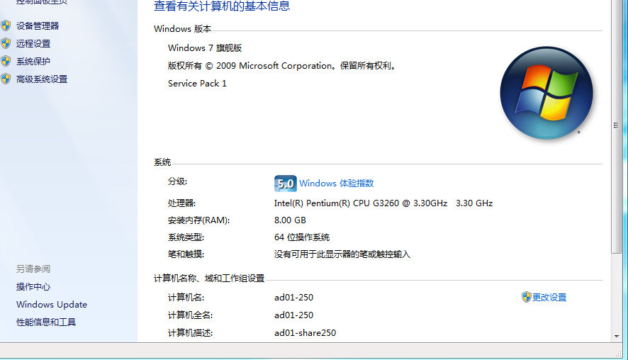
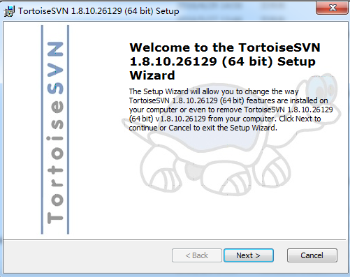
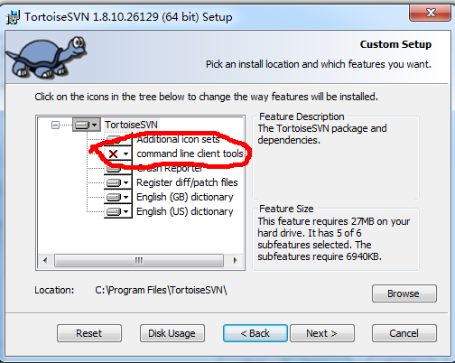
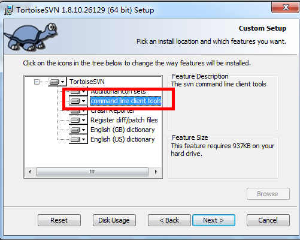
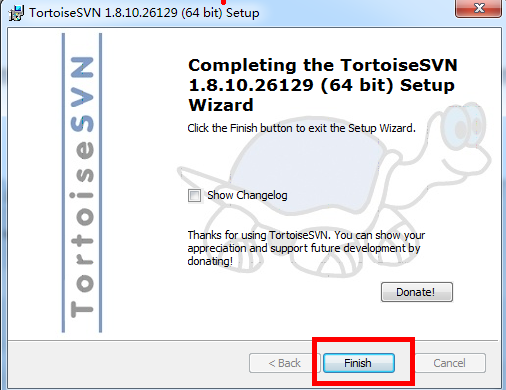
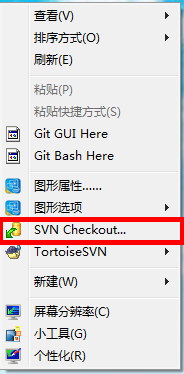
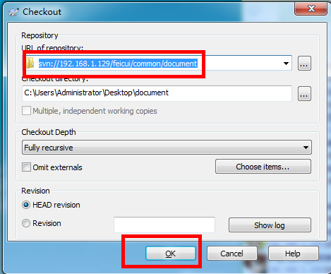
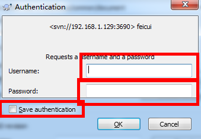
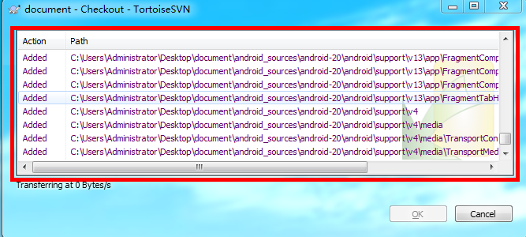

## TortoiseSVN 的安装与配置

1. 根据系统的版本，选择svn安装程序，查看系统信息方式，右键我的电脑属性，查看系统类型
    

2. 执行安装
    
   ​
     

3. 如果图中红色标记处没有安装， 会导致在 Android Studio 中 SVN 不能使用
    

    

4. 下一步 直至安装完成
    

5. 安装完成后 在任意位置空白处单击鼠标右键， 出现 如图标记内容， 表明安装成功
    

6. 单击 Checkout， 在弹出的输入框中， 输入一下内容可进行测试
   测试地址：[svn://192.168.1.129/feicui/common/document](undefined)

   测试账号: feicui_test

   密码：test
    

    

7. 验证通过后会从 SVN 下载内容， 完成后点击OK，完成下载。
    